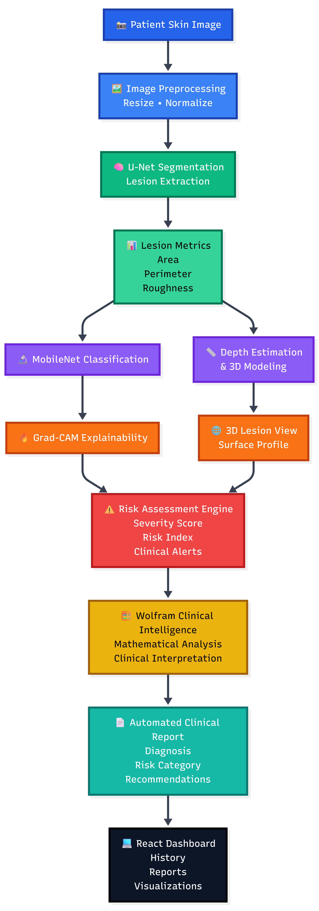
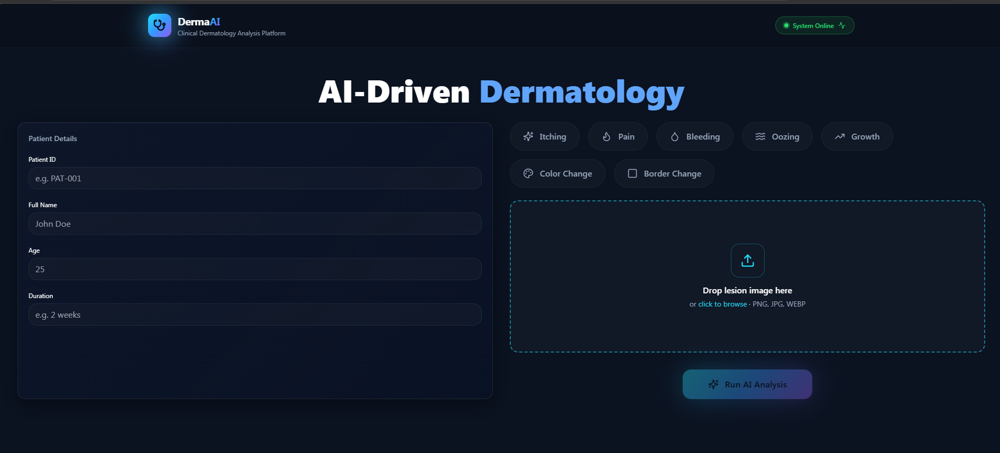
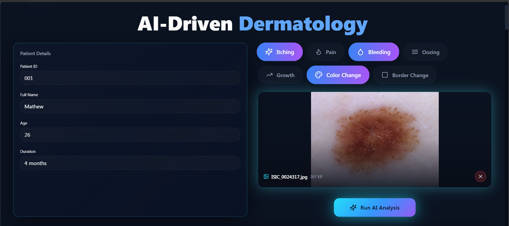
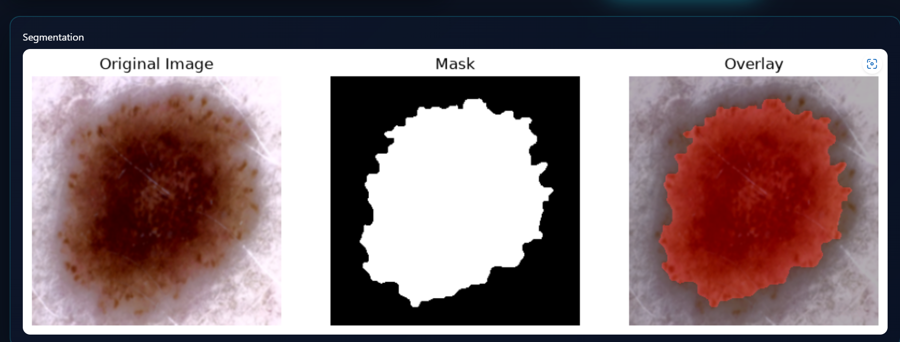
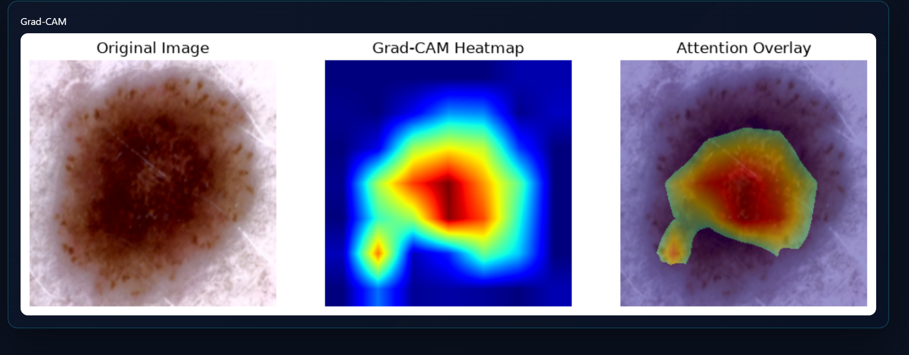
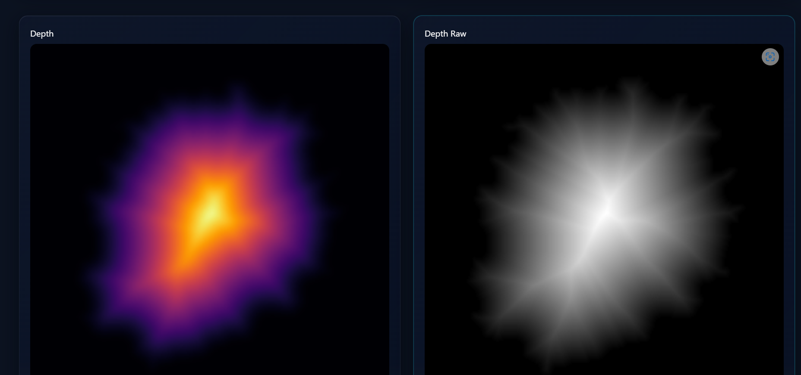
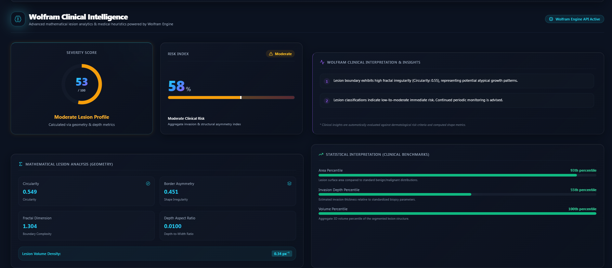
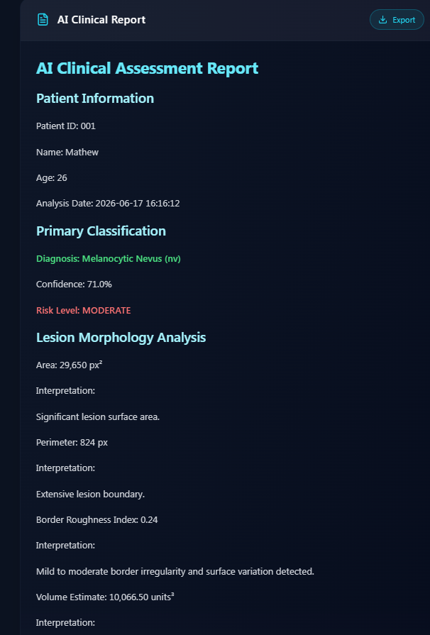

# DermaVision AI: Explainable Skin Lesion Diagnosis and Risk Assessment Platform

## Overview

DermaVision AI is an AI-powered dermatology platform designed to assist in early skin lesion assessment through explainable artificial intelligence, lesion segmentation, classification, depth estimation, 3D visualization, risk assessment, and automated clinical reporting.

The platform combines computer vision, deep learning, explainable AI, mathematical analysis, and interactive visualization to provide clinicians, researchers, and students with comprehensive skin lesion analysis and decision support.

---

## Live Demo

### Frontend (Vercel)

https://skin-lesion-diagnosis-eight.vercel.app/

### Backend (Google Cloud Run)

https://dermavision-backend-530379106718.us-central1.run.app

### API Documentation

https://dermavision-backend-530379106718.us-central1.run.app/docs

---

## Key Features

* Automated skin lesion segmentation using U-Net
* Skin lesion classification using MobileNet
* Explainable AI with Grad-CAM visualization
* Lesion depth estimation
* 3D lesion surface reconstruction
* Morphological feature extraction
* Clinical risk assessment engine
* Wolfram Clinical Intelligence integration
* Automated clinical report generation
* Patient history management
* Interactive medical dashboard
* Cloud-based deployment

---

## System Architecture

---

## Workflow

1. User uploads a dermoscopic skin lesion image.
2. Image preprocessing is performed.
3. U-Net segments the lesion region.
4. Morphological lesion metrics are extracted.
5. MobileNet predicts lesion category.
6. Grad-CAM generates explainability heatmaps.
7. Depth estimation computes lesion thickness.
8. 3D reconstruction visualizes lesion topology.
9. Risk assessment engine calculates severity indicators.
10. Wolfram Clinical Intelligence performs mathematical analysis.
11. Automated clinical report is generated.
12. Results are presented through the web dashboard.

---

## Technology Stack

### Frontend

* React
* TypeScript
* Vite
* Tailwind CSS
* shadcn/ui

### Backend

* FastAPI
* Python
* SQLite

### Deep Learning

* PyTorch
* MobileNet
* U-Net

### Computer Vision

* OpenCV
* Scikit-Image
* NumPy
* SciPy

### Visualization

* Plotly
* Matplotlib

### Deployment

* Vercel
* Google Cloud Run
* Docker

---

## Datasets

This project utilizes publicly available dermatology datasets:

* HAM10000 Dataset
* ISIC 2018 Skin Lesion Dataset

These datasets were used for lesion classification and segmentation model development.

---

## Results

### Dashboard

### Analysis Interface

### Segmentation Result

### Grad-CAM Explainability

### Depth Estimation

### 3D Lesion Reconstruction

### Wolfram Clinical Intelligence

### Automated Clinical Report

---

## Clinical Metrics Generated

The platform automatically computes:

* Lesion Area
* Relative Area Percentage
* Perimeter
* Border Roughness
* Volume Estimation
* Maximum Depth
* Mean Depth
* Severity Score
* Risk Index
* Mathematical Lesion Analysis

---

## Explainable AI Components

DermaVision AI incorporates multiple explainability mechanisms:

* Grad-CAM heatmap visualization
* Lesion boundary extraction
* Morphological analysis
* Risk score transparency
* Mathematical interpretation of lesion characteristics
* Clinical decision-support insights

---

## Deployment Architecture

Frontend Application

* Hosted on Vercel

Backend API

* Hosted on Google Cloud Run

Containerization

* Docker

Model Storage

* PyTorch Model Weights (.pth)

---

## Team

### Project Members

* Roshan L
* Navya S
* Sanjay
* Sam Roshan

---

## Future Enhancements

* Multi-class clinical decision support
* Temporal lesion progression tracking
* Mobile application deployment
* Electronic Health Record (EHR) integration
* Dermatologist feedback loop learning
* Advanced clinical recommendation engine

---

## License

MIT License

---

## Acknowledgements

* ISIC Archive
* HAM10000 Dataset
* PyTorch
* FastAPI
* React
* Google Cloud Platform
* Vercel
* Plotly
* OpenCV
